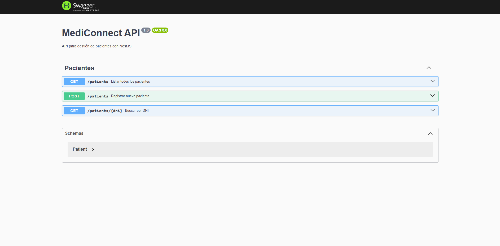

# 🏥 MediConnect API | Hospital Management System

> A robust RESTful API built with **NestJS** and **TypeScript** for managing patient records and medical scheduling.



## 📖 About The Project

**MediConnect API** is a backend service designed to handle the core logic of a hospital's admission system. It serves as a centralized hub for:
* Patient Registration & Lookup.
* Medical History Management.
* (Planned) Appointment Scheduling.

The project demonstrates a **Microservice-ready architecture** using the **Module Pattern** enforced by NestJS, ensuring separation of concerns and scalability.

## 🛠️ Tech Stack & Key Concepts

* **Framework:** [NestJS](https://nestjs.com/) (Node.js framework for scalable server-side apps).
* **Language:** TypeScript (Strict typing for reliability).
* **Documentation:** Swagger / OpenAPI (Auto-generated interactive documentation).
* **Architecture:** Modular (Controller-Service-Repository pattern).
* **Environment:** Node.js.

## ✨ Key Features

* **Modular Design:** Logic is encapsulated in feature modules (`PatientModule`), making the codebase easy to maintain and test.
* **In-Memory Persistence:** Currently uses an efficient in-memory data structure for instant setup and testing (no database installation required for reviewers).
* **Auto-Documentation:** Fully integrated with Swagger UI to visualize and test endpoints directly from the browser.
* **Validation:** Implementation of DTOs (Data Transfer Objects) and pipe validation.

## 🚀 Getting Started

To run this API locally, you don't need Docker or a database. Just Node.js.

### 1. Clone the repository
```bash
git clone [https://github.com/FranVldv/medical-api.git](https://github.com/FranVldv/medical-api.git)
cd medical-api